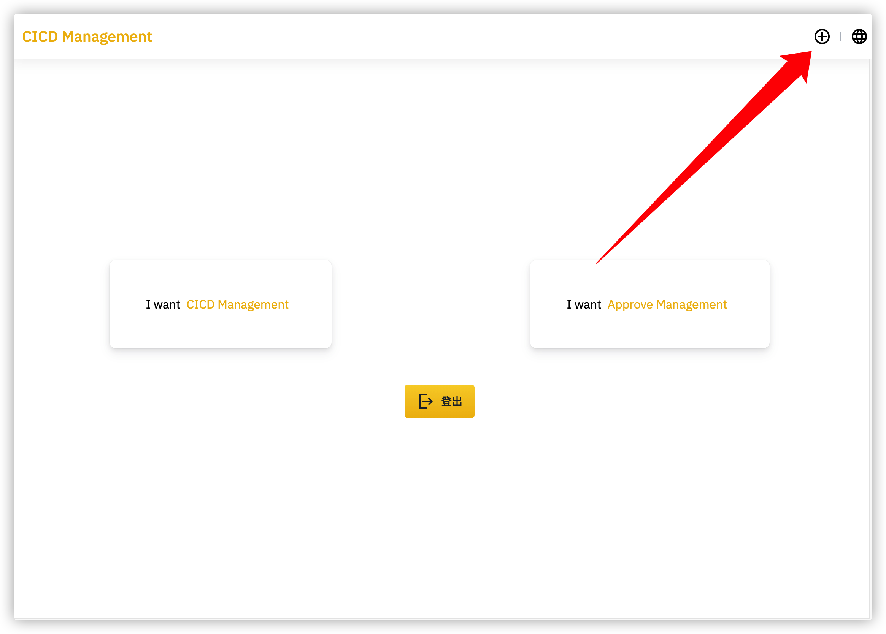
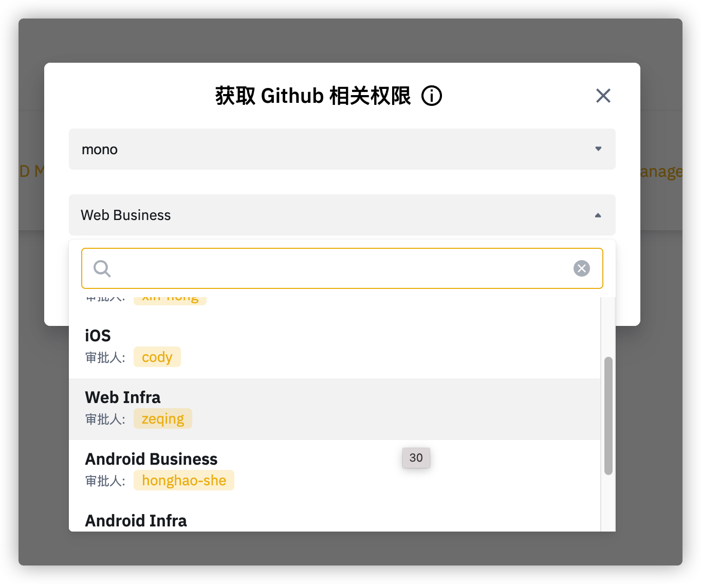

## 入职员工权限开通指南
### Okta

https://binance.okta.com

### Jira 项目管理工具
权限负责人:  Jack Ding (jack.ding@binance.com)

####  Exchange(EX)项目
权限负责人:   LE (lyle.zheng@binance.com)

####  COM 项目
权限负责人:   Alice S(QA-RM-Tech) (Alice.sun@binance.com)

### 小程序开发权限
权限负责人: James L Gette (james.l@binance.com)

### figma
权限负责人: 待补充

***

## GitHub Enterprise 
权限负责人:  Jack Ding (jack.ding@binance.com)
### 注册GitHub Enterprise

* 通过 okta dashboard 登录一次 GitHub Enterprise

### GitHub Enterprise 加入 organization

进入 github管理系统申请权限
https://cicd-manage-fe.toolsfdg.net/

* 点击这里,添加github权限
  

* 选择加入的Github organization 与部门
  

### 关于Git cli以及Git 管理客户端鉴权问题

* 不支持使用SSH
* 登陆账号为: GitHub Enterprise用户名 (不是邮箱)
* 登陆密码为:  GitHub Enterprise access token

> 获取GitHub Enterprise access token: `setting -> developer setting -> Personal access tokens`

### 代码发布

*  [测试环境发布流程](https://libs.fe.devfdg.net/ci-cd/test-pr/)
*  [生产环境发布流程](https://libs.fe.devfdg.net/ci-cd/release/)

## 组件库

https://libs.fe.devfdg.net/uikit-core/getting-started/

负责人: Yuchao Liang (yuchao.liang@binance.com) 或者 Billy (Billy@binance.com)
## 测试系统

https://qcenter.k8s.qa1fdg.net/

#### 使用测试系统创建测试账号

https://qcenter.k8s.qa1fdg.net/tools#/data-platform/user/user-create