## 开发环境准备

### 常用开发工具
*  [Nodejs](https://nodejs.org/en/)
*  [yarn](https://yarnpkg.com/getting-started/install)
*  [Git](https://git-scm.com/)
*  [sourceTree](https://www.sourcetreeapp.com/)
*  [Visual Studio Code](https://code.visualstudio.com/)
*  [FEHeader 浏览器插件](https://chrome.google.com/webstore/detail/feheader/omloppmdelcfeablljmjmonacajpfpmj)

> 在工作电脑是否可以安装你想要的软件,请进入下面的表格查看.

[[MacOS]允许軟件类别 与 禁用软件类别](https://docs.google.com/spreadsheets/d/1X2GUeCFFyDFxUy1x5osgv86m-3NYWAV6vjBuiSa37zk/edit#gid=1345848083)


## 如何启动mono项目

[mono详细操作](https://libs.fe.devfdg.net/)


### 获取登陆状态的cookie

1. 进入指定环境网站登陆
2. 打开devtool打开network选项
3. 选择一条 `Fetch/XHR`记录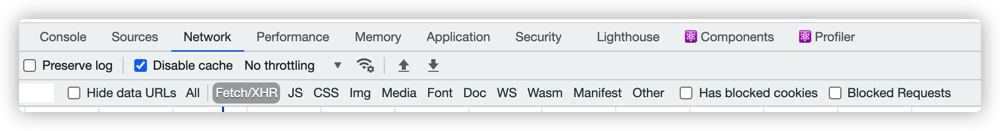  

4. 拷贝出当前记录的cookie
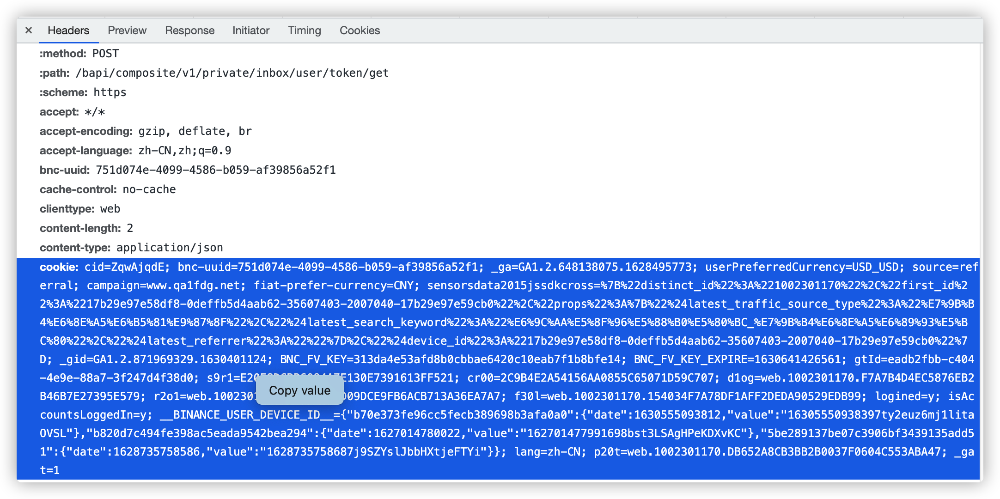  

## fake login

* 在.env文件中确认连接的是dev/qa环境数据 (控制台也可以看到,当前项目请求的API域名)
* 确认环境之后,到指定的环境(测试或者开发)登陆你的账号
* 在浏览器中的network随便找一个接口,拷贝cookie复制到fake login输入框,完成登陆
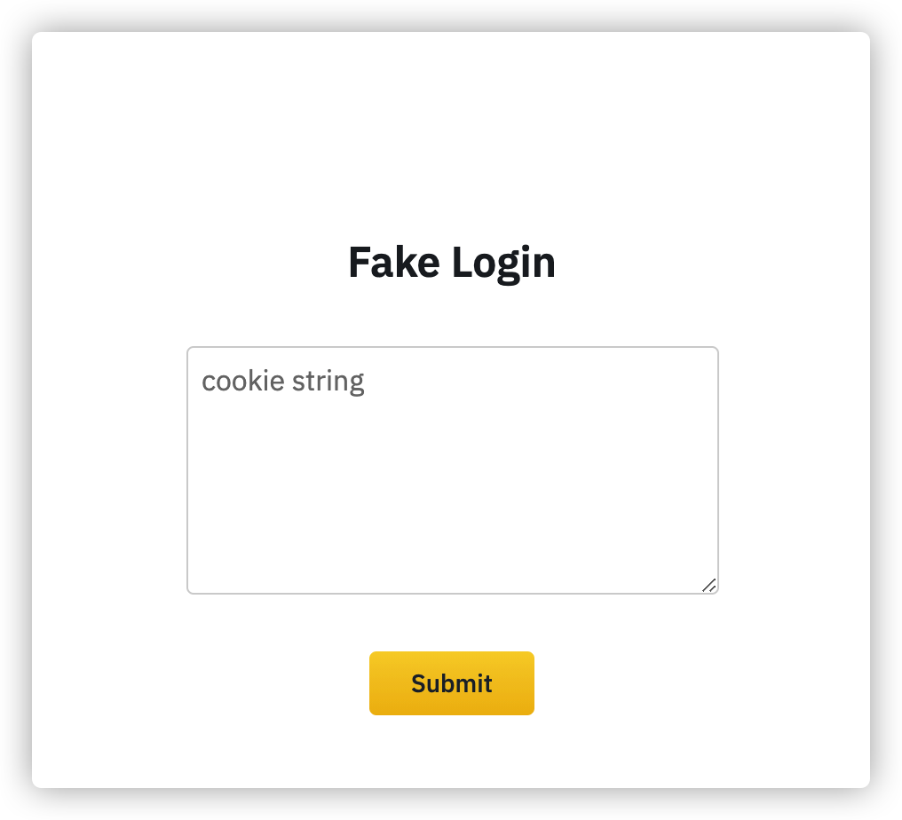  

## FEHeader 浏览器插件访问指定环境
> 一个修改请求header的工具, 测试环境可通过请求头`k8scluster`区分不同pr对应的测试环境.
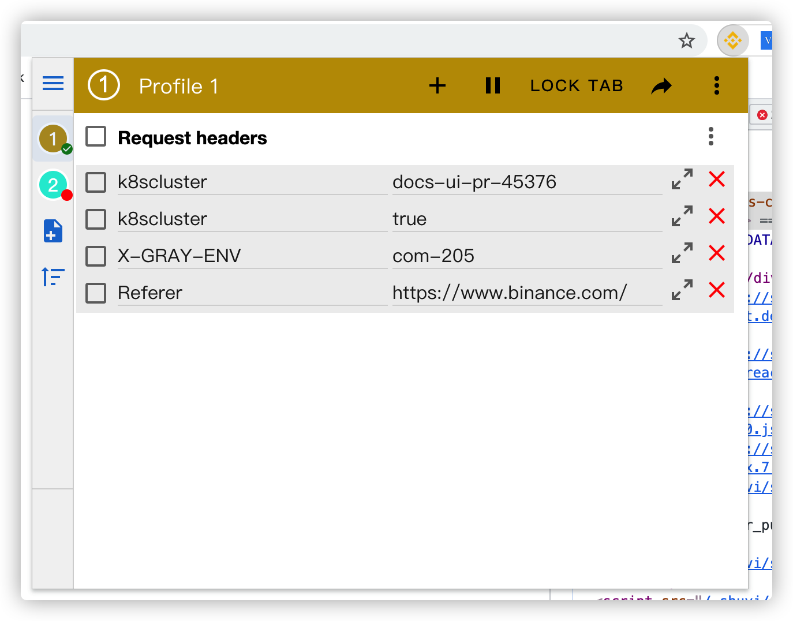  


下载地址: [点击这里](https://chrome.google.com/webstore/detail/feheader/omloppmdelcfeablljmjmonacajpfpmj)

详细使用方法 : [点击这里](/docs/infra/feheader/instructions)
## 访问指定测试环境
```
k8scluster: {projectName}-pr-{prID}
// demo : k8scluster: docs-ui-pr-10000
```

## 访问灰度环境
进入使用生产域名进入网站,设置该请求头,即可进入灰度环境.
```
k8scluster: true
```

## 环境

* [开发环境 : https://www.devfdg.net](https://www.devfdg.net)
* [测试环境 : https://www.qa1fdg.net](https://www.qa1fdg.net)
* [生产环境 : https://www.binance.com](https://www.binance.com)


## mono项目中的环境变量配置

子项目根目录下会有一个 `.env`文件,环境变量配置方法如下:

```
STATIC_HOST=https://static.devfdg.net
API_HOST=https://admin-ui.devfdg.net
FRAMEWORK_URL=https://admin-framework.fe.devfdg.net
FRAMEWORK_LOCALURL=http://localhost:3000
TITLE=app-config
```

## 如何知道当前页面属于哪一个mono子项目

* 进入页面之后,打开开发者工具进入network
* 选择 Doc
* Doc的请求头 `x-debug-release` 就是应用名
* 在mono项目中 `mono/apps/`目录下可以找到该页面对应的项目


## 静态文件上传到cdn

> 原来是使用 [gitlab + CI/CD](https://git.toolsfdg.net/fe/exchange-ui-static) 管理静态文件上传,如今已经废弃.请勿使用

dev 环境地址
https://static-admin.fe.devfdg.net

线上环境地址
https://static-admin.blsdkrgjf.io/

权限申请: 在[okta](https://binance.okta.com/) 添加 `static-admin`应用


## 小程序篇

### 安装小程序cli工具

```
npm install -g @binance/mp-cli
```

### 安装小程序IDE工具
加入 🚀MP Framework Release 群后可获取

也可以在这个文档里,下载对应 cli与IDE工具  (https://docs.google.com/document/d/19vij8Il-1QwrL07dwxUdh8XEqQuYqMEpRf__o1ZlQ5w/)[点击这里]

### 使用cookie登陆你的小程序
1. 进入你的ide
2. 工具栏打开devtools
3. 进入inspect tool
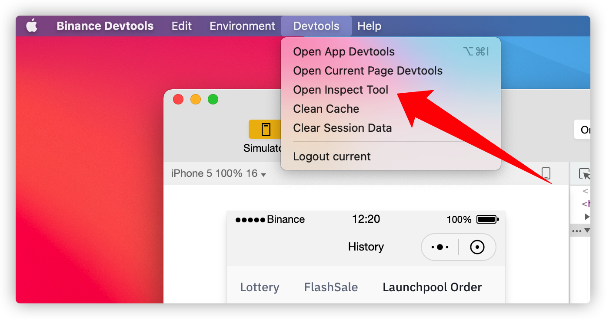  

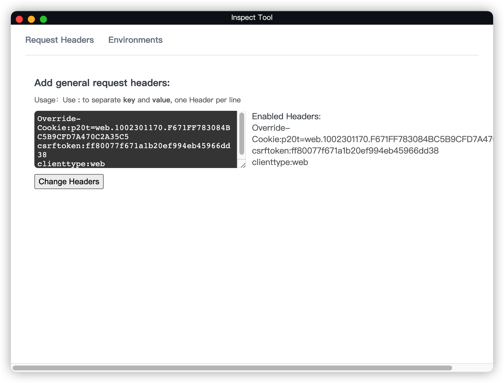  

输入框输入以下内容.
```
Override-Cookie: 你的cookie(p20t部分, 例如p20t=xxxxx)
csrftoken: 你的csrftoken
clienttype:web
```
> 如何获取cookie,[点击这里](#获取登陆状态的cookie)

1. 点击 change Headers 确认

> 进入不同环境,与FEHeader插件一致 浏览器规则一致,[详细请看这里](/docs/infra/feheader/instructions)


### 审查你的小程序元素

1. 进入你的ide
2. 工具栏打开devtools
3. 进入open Current Page Devtools
4. 弹出的 devtool 就可以审查你的小程序页面了.

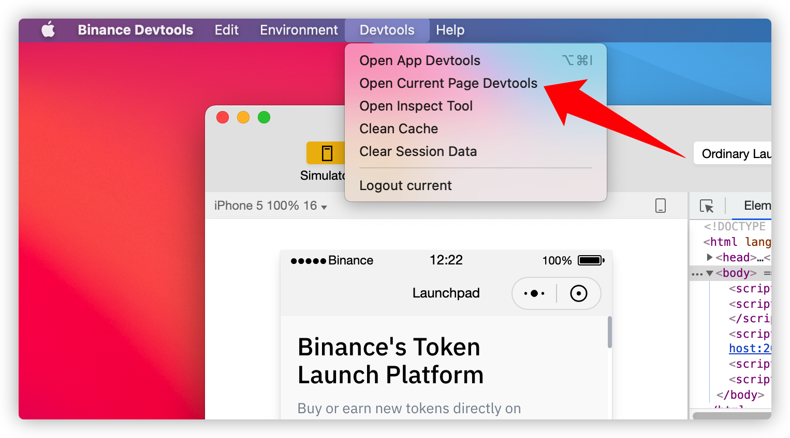  


### IOS 本地模拟器调试你的小程序
1. 在 app store下载 xcode [公司提供的AppStore账号](https://docs.google.com/document/d/1aXuC5wmvUYnXwRwrhxuTP7CREanUhDTs6Cye1sj-djE/edit)
2. 打开你的模拟器,[点击查看这种方法方便你以后使用](https://segmentfault.com/a/1190000021548377)
3. 使用模拟器的safari打开 https://app.toolsfdg.net/apps/2/plats/2 选择版本,安装binance IOS应用
4. 点开悬浮在UI上的doki入口
5. 选择Nezha,进入你需要调试的小程序

### Android 本地模拟器调试你的小程序

*  下载 Android Studio,安装模拟器[点击这里查看详细教程](/docs/native/android/tech/infra/android-emulator)

1. 创建模拟器
   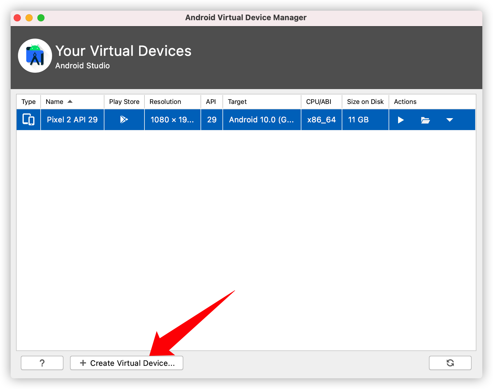  

2. 选择一个机形,点下一步
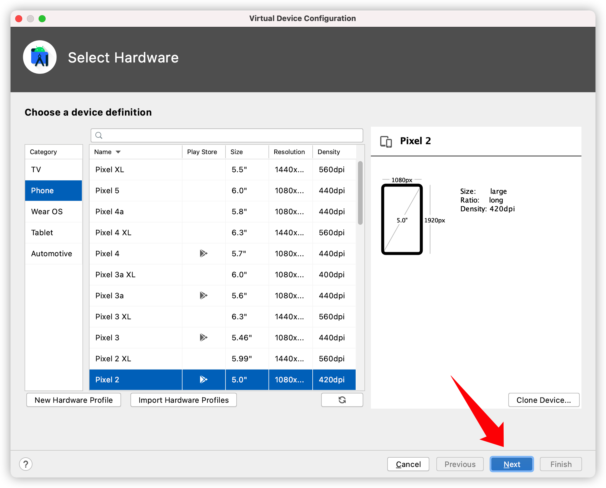  

3. 选择一个 x86_64的系统镜像
   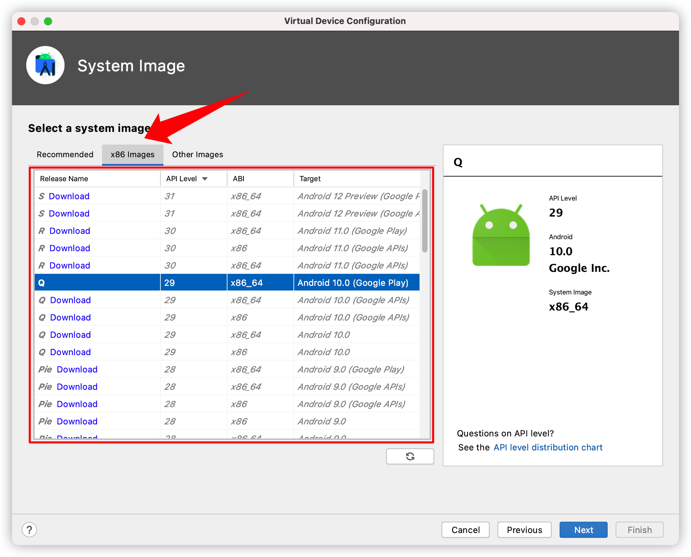  


重要的事情说三遍
> 流程到选择模拟器镜像的的时候,请选择 x86_64的.
> 
> 流程到选择模拟器镜像的的时候,请选择 x86_64的.
> 
> 流程到选择模拟器镜像的的时候,请选择 x86_64的.


4. 一直点下一步,直到结束.

## 安装测试应用

*  在 https://app.toolsfdg.net/apps/4/plats/15 下载Android 的binance应用.
*  点开悬浮在UI上的doki入口
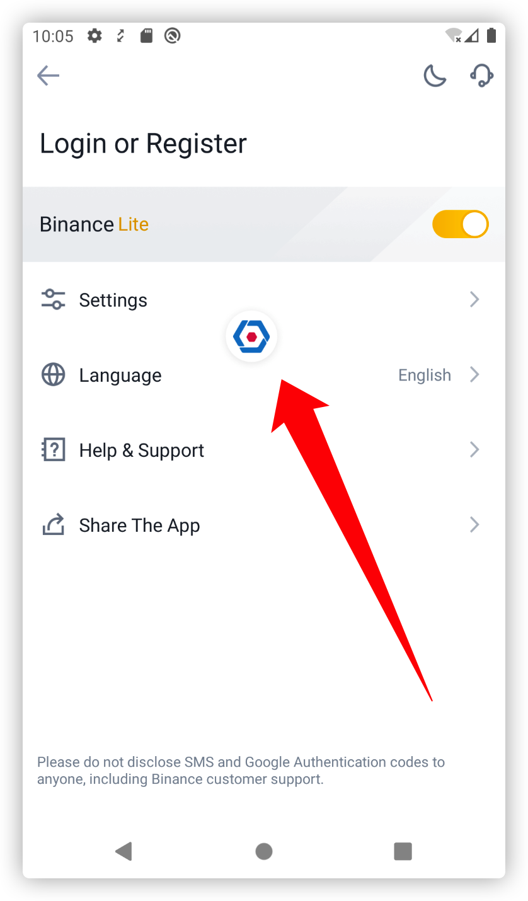  

*  选择Nezha,进入你需要调试的小程序
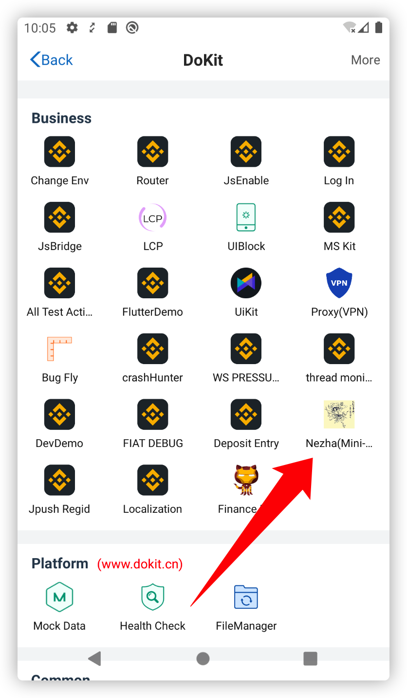  


## Mono篇
### libs与node_mosules的关系

libs中的代码会共享给各个项目使用,需要注意的是在业务代码中引用libs代码并不是直接使用webpack的alias.
而是编译libs之后,将代码链接到node_modules目录中.这样就直接实现了npm引用的效果. 
这里的处理方式参考 [yarn workspaces](https://classic.yarnpkg.com/en/docs/workspaces/)

如果你需要修改libs的代码,`一定要开启watch libs模式`, 不然未编译的代码,会直接被引用.出现一些意想不到的问题.

```bash
mono start -p lib-docs-ui -w uikit-core -w uikit-widget -w uikit-theme
```
### 切分支后的原分支的缓存,会有可能造成意想不到的问题.

当你在并行开发多个任务的时候,有可能会同时在一个仓库切换不同分支.
需要注意的是,切换分支后,你的业务代码所依赖的 libs 也会相应的改变.
但是node_modules里边的内容,不会随着分支切换改变.

所以就可能造成,业务代码,libs,node_modules对应不一致的问题.

解决办法:

重新使用`mono start -p yourProject`
> mono start 会重新编译当前项目依赖的libs,并且拷贝到node_modules中