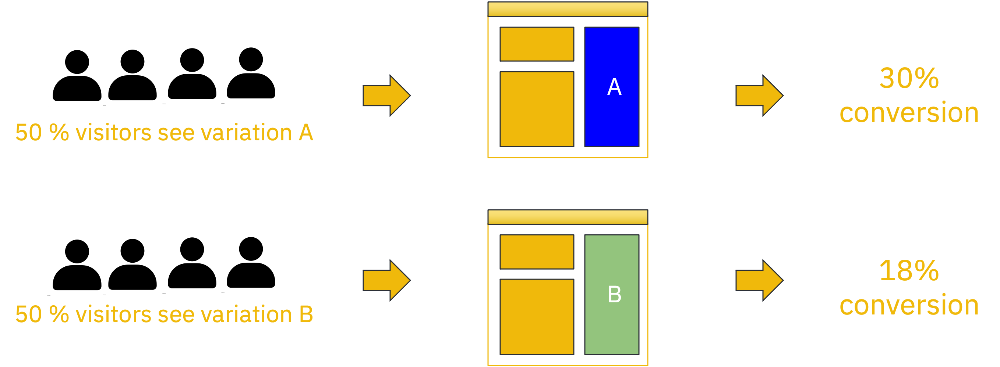
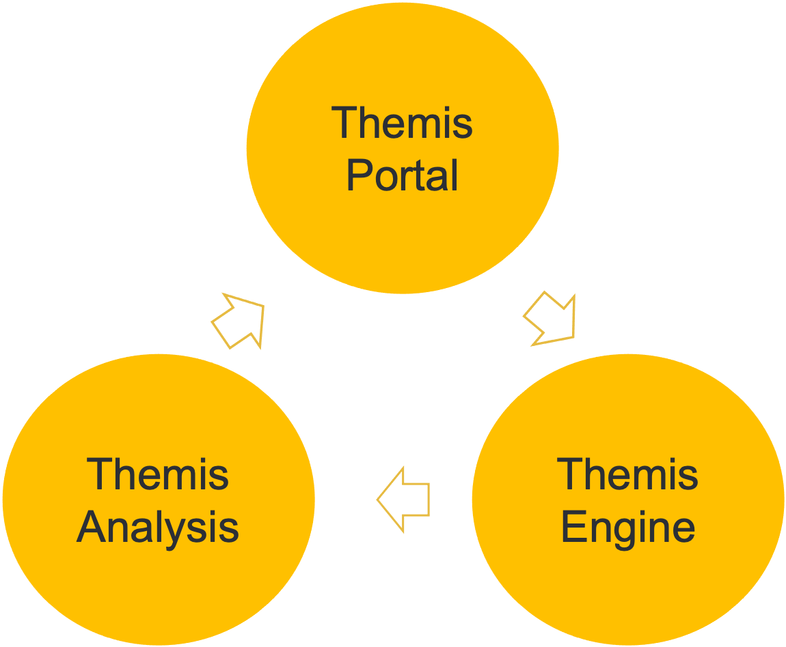

# Themis
Themis, which consists of portal, engine, and analysis, provides a complete set of strategy distribution services, which can customize different strategies for different users according to multiple dimensions such as App version and language.

It supports strategy distribution and can ensure that a user's strategy remains unchanged. Can test different functions online to help the product owner make a correct decision.

## Themis Portal
In the portal, the user can remote config strategy and see the result of general experiment analysis.

## Themis Engine
Themis engine mainly computes traffic splitting and registers each unique identifier(user).

## Themis Analysis(Developing)
Once running a strategy online, themis analysis gets activated to do a series of data processing and analysis to help strategy owners to make the best decision for their product.

## Implementation Path
1. Strategy Owner Apply Okta Auth. (search abtest-admin)
2. Login Portal and Create a strategy in the Themis portal and define the variants you want to evaluate with an A/B test.
3. The developer uses Themis SDK/API to get the user located group and operate different logic for each user.
4. Monitor and analyze the data during the experiment.
5. Once finished with the experiment, safely roll out the final version to all users.
