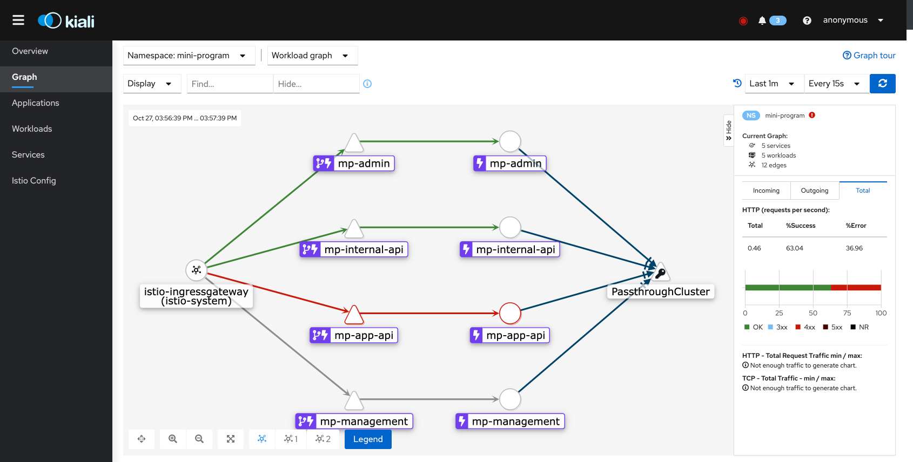

## Overview

Kiali 由 Red Hat 开源的，用于解决 Service Mesh 中可观察性即微服务的可视性问题. 目前已获得 Istio 社区的官方支持. Kiali回答了我的Istio Service Mesh有哪些microservices，以及他们是如何连接的的问题。

Kiali 可以帮助定义、验证并观察 Istio 服务网格。它所提供的拓扑结构可以帮助您了解服务网格的结构，并提供服务网格的健康状况信息。

Kiali 实时提供命名空间的交互式图形视图，可让您了解诸如电路断路器、请求率、延迟甚至流量图等功能

Kiali 提供了从应用程序到服务以及负载等不同级别的组件的了解，并可显示与所选图形节点或边缘的上下文信息和图表的交互。

Kiali 还提供了验证 Istio 配置（如网关、目的规则、虚拟服务、网格策略等等）的功能。

Kiali 提供了详细的指标数据，并可使用基本的 Grafana 集成来进行高级查询。通过将 Jaeger 集成到 Kiali 控制台来提供分布式追踪。

## 架构

Kiali 由两个组件组成: Kiali 应用程序和 Kiali 控制台。

   - Kiali 应用程序 （后端）- 该组件运行在容器应用程序平台中，并与服务网格组件进行通讯，检索和处理数据，并将这些数据提供给控制台。Kiali 应用程序不需要存储。当在集群中部署应用程序时，配置在 ConfigMaps 和 secret 中设置。
   - Kiali 控制台 (前端) – Kiali 控制台是一个 Web 应用程序。Kiali 应用程序为 Kiali 控制台提供服务，控制台会查询后端数据并把数据提供给用户。

此外，Kiali 依赖于由容器应用程序平台和 Istio 提供的外部服务和组件。
- **Istio Service Mesh**： Kiali是istio的管理控制台，需要检索istio的数据和配置，从而生成可视化图表。虽然istio和kiali独立安装，但如果没有istio，kiali无法正常工作。istio的数据和配置通过Prometheus和cluster API获得。
- **Prometheus**： 一个专用的 Prometheus 实例作为 Istio Service Mesh 安装的一部分被包括。启用 Istio Telemetry时，指标数据存储在 Prometheus 中。Kiali 使用这个 Prometheus 数据来决定网状拓扑结构、显示指标数据、计算健康状况、显示可能的问题等等。Kiali 与 Prometheus 直接沟通，并假设 Istio Telemetry 使用的数据 schema。Istio 依赖于 Prometheus，Kiali 也依赖于 Prometheus。许多 Kiali 的功能在没有 Prometheus 的情况下将无法工作。
- **Cluster API**： Kiali 使用Container Application Platform (cluster API，例如kubernetes， OKD以及其衍生物) API 来获取和解析服务网格配置。Kiali 通过查询集群 API 获取信息，如获取namespaces、services、deployments、pods 和其他实体的定义。Kiali 还提供查询来解析不同集群实体之间的关系。另外，还可以通过查询集群 API 以获取 Istio 配置，比如 virtual services, destination rules, route rules, gateways,quotas等等。
- **Jaeger**： 是可选的。
- **Grafana**：Grafana 是可选的。如果使用了 Grafana，Kiali 的 metrics 页会包括一个链接，用户可以使用它访问 Grafana 中相同的指标数据。Kiali拥有基本的metric功能，可以显示工作负载、应用程序和服务的默认 Istio 指标，并允许提供的指标分组并按照不同的时间范围获取指标。但Kiali 不允许自定义视图或 Prometheus 查询， 如果需要这些功能，则需要安装grafana.

下图展示了 kiali 中显示的 小程序 namespace下所有应用示例的服务拓扑图。

## 现有的Kiali

1. [frontend global](https://kiali.fe-com.toolsfdg.net/)
1. [frontend global standby](https://kiali-r1.fe-com.toolsfdg.net/)
1. [frontend China](https://kiali.fe-hk.toolsfdg.net/)
1. [frontend China standby](https://kiali-r1.fe-hk.toolsfdg.net/)
1. [dev](https://kiali.devfdg.net/)
1. [QA](https://kiali.qa1fdg.net/)
