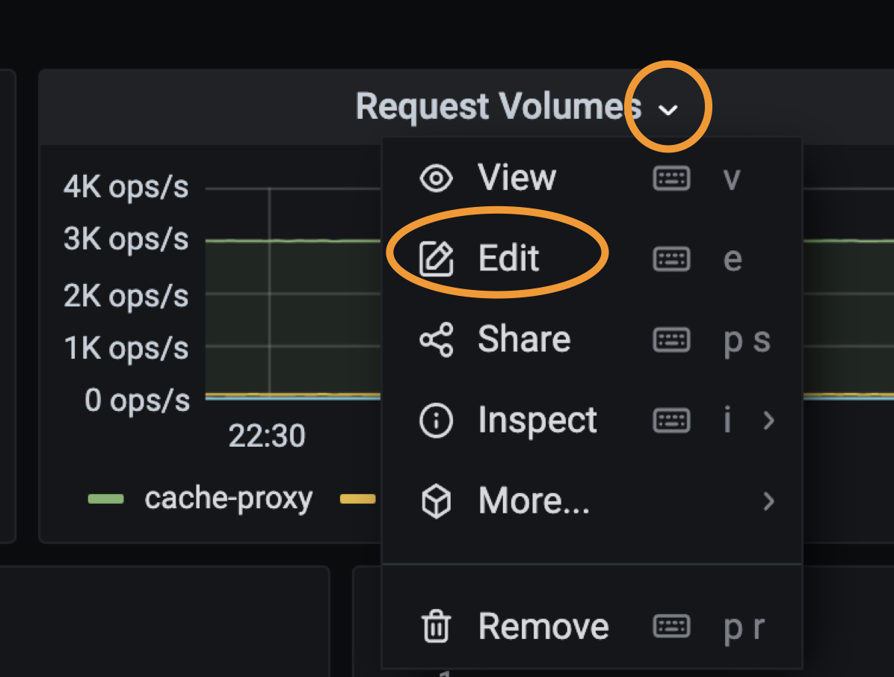

## Overview
Grafana是由 Grafana Labs 公司开源的的一个系统监测 (System Monitoring) 工具，有着功能齐全的可视化dashboard，支持Prometheus，Graphite，InfluxDB，ElasticSearch，MySQL等多种数据源。[grafana支持的数据源类型](https://grafana.com/docs/grafana/latest/features/datasources/#supported-data-sources/)

Grafana 让用户能够更直观地观测到各项数据指标的变化趋势（网格流量变化、组件资源使用情况等），是实现可观测性最重要的组件之一

## 主要的Dashboards
目前我们已有多个dashboard实现了不同级别的监控信息
1. 前端总的监控页面 [前端总页面监控](https://monitor-prod.toolsfdg.net/d/Orh1I28Gk/fe-mesh-dashboard?orgId=1)
1. 应用程序级别的监控 [workloads monitoring](https://monitor-prod.toolsfdg.net/d/O_RQnRwGk/fe-mesh-dashboard-workload-details?orgId=1)
    - 进出口流量
    - CPU， Memeory使用情况
    - Pod相关信息
    - Release相关信息
1. 存储相关
    1. 数据库Mysql [MySQL监控](https://monitor-prod.toolsfdg.net/d/AWSRDSdbi/mysql-jian-kong?orgId=1)
    1. 缓存Redis [Redis监控](https://monitor-prod.toolsfdg.net/d/HAqxGlinz/redis-jian-kong?orgId=1)
1. Infra层 [EKS Cluster](https://monitor-prod.toolsfdg.net/d/CGbToQ3Zz/qian-duan-eks-clusterjian-kong-da-ping?orgId=1)
1. 应用层序内部
    1. golang使用 [golang监控](https://monitor-prod.toolsfdg.net/d/CgCw8jKZz/go-metrics?orgId=1)
1. 前端性能
    1. Mobile端北极星分数 [Mobile Polaris](https://monitor-prod.toolsfdg.net/d/QvcI_gNMk/app-polaris-dashboard?orgId=1)
    1. Web北极星分数 [Web Polaris](https://monitor-prod.toolsfdg.net/d/QvcI_gNMj/web-polaris-dashboard?orgId=1)
    1. 页面性能 [Web Performance](https://monitor-prod.toolsfdg.net/d/QvcI_gNM8/web-polaris-performance-dashboard?orgId=1)
    1. 单页面性能 [Single Page](https://monitor-prod.toolsfdg.net/d/4WDfjL1Mk/qian-duan-ye-mian-xing-neng-yong-hu-ce-shu-ju-dan-ye-mian?orgId=1)

## 构建自己的Dashbaord
按照下列步骤构建自己的Dashboard
1. 确认数据源是否正确配置，如果没有，请找devops团队的Tracy Z帮忙配置数据源
1. 选择需要搭建的dashboard，通过grafana界面的**import**选项，导入需要的template. template在mono repo下的/infra/dashboard中

1. 更改grafana的过滤配置，通过设置 -> Variables -> 选择变量，根据不同的数据源，更改Variables的query语句[详细](https://grafana.com/docs/grafana/latest/variables/)
1. 更改每个dashbaord的数据源，以及根据自己的需求更改现有的dashboard
    1. 添加: 点击整个dashboard页面右上角的图标，添加panel 或者row（一种panel的组织形式）

    

    1. 删除: 选择需要删除的panel，单击panel上向下的箭头，点击remove

    

    1. 编辑: 选择需要删除的panel，单击panel上向下的箭头，点击edit

    
    

## 现有的Grafana

1. [frontend global](https://grafana.fe-com.toolsfdg.net/)
1. [frontend global standby](https://grafana-r1.fe-com.toolsfdg.net/)
1. [frontend China](https://grafana.fe-hk.toolsfdg.net/)
1. [frontend China standby](https://grafana-r1.fe-hk.toolsfdg.net/)
1. [dev](https://grafana.devfdg.net/)
1. [QA](https://grafana.qa1fdg.net/)
