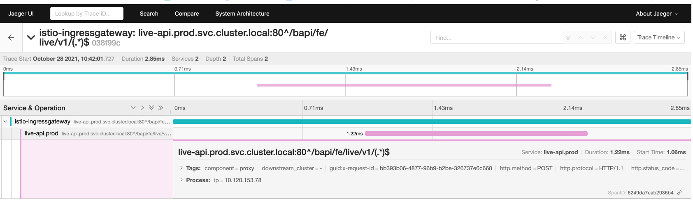

## Overview 
Jaeger是是遵循 OpenTracing 的一种实现，可用来检测服务，以收集与服务架构相关的信息，实现监控分布式事务、优化性能和延迟时间并进行故障排除。

## 架构

Jaeger 由几个组件组成，它们一起收集、存储和显示追踪数据。

- **Jaeger Client** - Jaeger client 是 OpenTracing API 的具体语言实现。它们可用于手动或通过与OpenTracing集成的各种现有开源框架(例如Flask,Dropwizard,gRPC等)来检测应用程序以进行分布式跟踪。
接收服务的服务会在接收到新请求时创建spans,并将上下文信息(spans,id,span id和baggage)附加到传出的请求。 只有ID和id和baggage随请求一起传播；不会传播构成spans的所有其他信息,例如操作名称,日志等。取而代之的是,采样的spans会在后台异步传输到Jaeger Agents的进程外。虽然生成了所有trace,但仅采样了一些。对跟踪进行采样将跟踪标记为进一步处理和存储。 默认情况下,Jaeger客户端对0.1％的迹线进行采样(每1000个中的1个),并且能够从代理中检索采样策略。
- **Jaeger Agent** - Jaeger 代理是一个网络守护进程，它会监听通过 User Datagram Protocol (UDP) 发送的 span，并发送到收集程序。这个代理应被放置在要管理的应用程序的同一主机上。这通常是通过如 Kubernetes 等容器环境中的 sidecar 来实现的。
- **Jaeger Collector** - 与代理类似，该收集器可以接收 span，并将其放入内部队列以便进行处理。这允许收集器立即返回到客户端/代理，而不需要等待 span 进入存储。
- **Storage (Data Store)** - 收集器需要一个持久的存储后端。Jaeger 带有一个可插入的机制用于 span 存储。支持将数据写入 cassandra、elastic search。
- **Query** - 接收查询请求，然后从后端存储系统中检索 trace 并通过 UI 进行展示。
- **Ingester** - Jaeger 可以使用 Apache Kafka 作为收集器和实际后备存储 (Elasticsearch) 之间的缓冲。Ingester 是一个从 Kafka 读取数据并写入另一个存储后端 (Elasticsearch) 的服务。
- **Jaeger Console** – Jaeger 提供了一个用户界面，可视觉地查看所分发的追踪数据。在搜索页面中，可以查找 trace，并查看组成一个独立 trace 的 span 详情。

下图展示了 jaeger 中 live-api应用的追踪情况

## 现有的Jaeger

1. [frontend global](https://tracing.fe-com.toolsfdg.net/)
1. [frontend global standby](https://tracing-r1.fe-com.toolsfdg.net/)
1. [frontend China](https://tracing.fe-hk.toolsfdg.net/)
1. [frontend China standby](https://tracing-r1.fe-hk.toolsfdg.net/)
1. [dev](https://tracing.devfdg.net/)
1. [QA](https://tracing.qa1fdg.net/)
