## Basic Goals 
P75 (75th percentile) :  LCP < 1.8s, FID < 50ms, CLS < 0.05  
Check In Grafana (apply permissions) 


## What is LCP/FID/CLS?
LCP: https://web.dev/lcp/  
FID: https://web.dev/fid/  
CLS: https://web.dev/cls/  

## Setup
### Add SDK 
For performance monitoring, add @binance/performance  in project: 
```shell
yarn add @binance/performance  
```
In root component (e.g `_app.js` in Nextjs):  
```js
import '@binance/performance'

export default App () {
  return <div></div>
}
```

### Add Chrome plugin 
For local debugging, you can see the main performance indicators(LCP/FID/CLS) by using plugin
https://chrome.google.com/webstore/detail/web-vitals/ahfhijdlegdabablpippeagghigmibma?hl=zh-CN
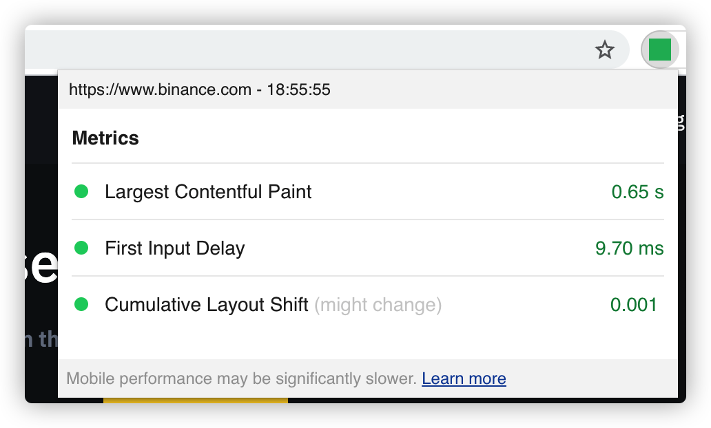


# How to optimize performance?
## Reduce LCP 
### Use CDN   
Use CDN to serve all static files(js/image/css/fonts/...)  
- In China (binancezh.com) it’s served by myqcloud.com  
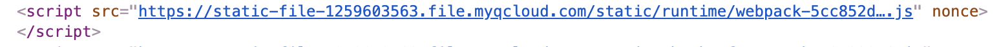
- In Other Country  (binance.com)  it’s served by bin.bnbstatic.com  
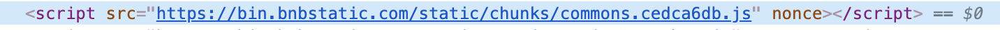

see the example in trade-next-ui  
### Reduce Doc size  
- reduce base64  
use CDN to serve static files instead of base64 and lazy loading it.  
base64 is too large:
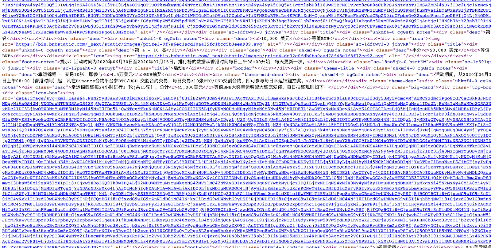  
use svg:  
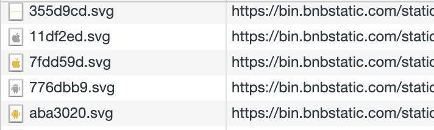

### Reduce JS bundle size
use @next/bundle-analyzer, to help reduce the packages size. 
For the configuration example, refer to caviar.config/next.js in home-ui


- use ES Module, for tree shaking
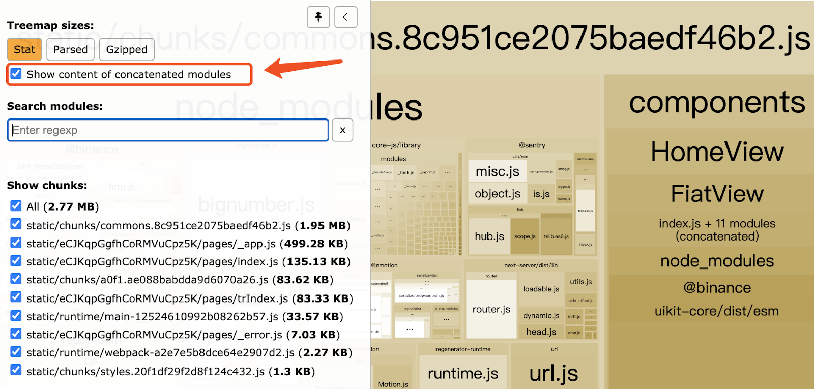  
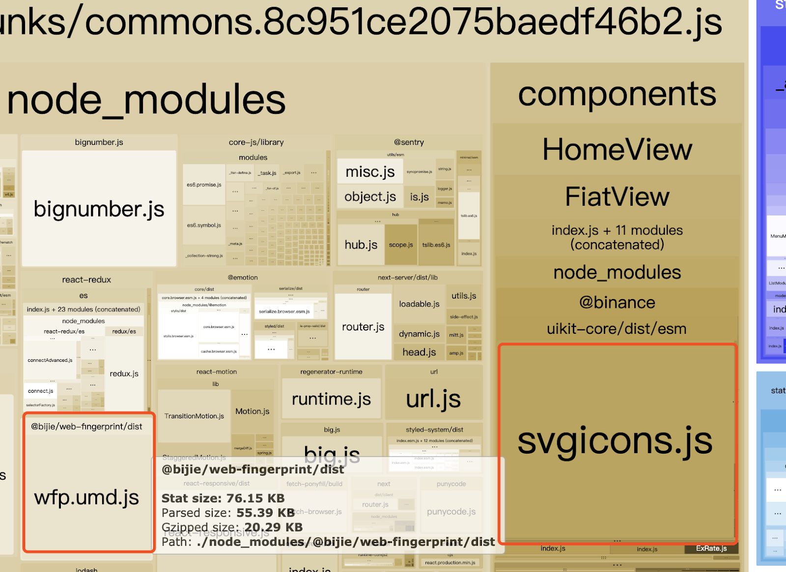  
`@bijie/web-fingerprint` and ` @binance/uikit-core` need to use ES Module:  
(a) Source code in @bijie/web-fingerprint:  
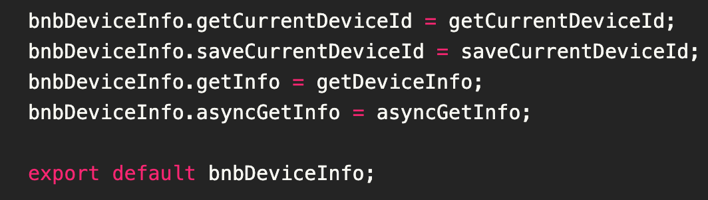  
changes to:  
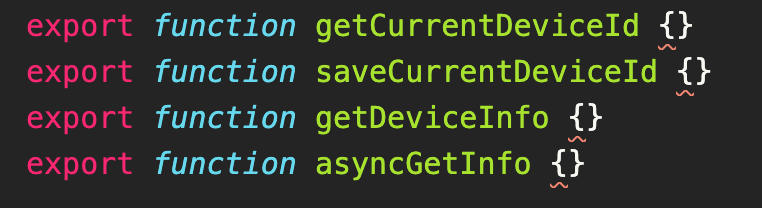  
 (b) Import only what you need, not all  
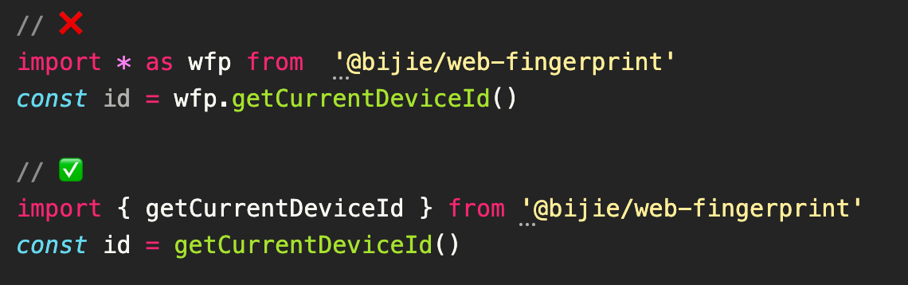  

- avoid using packages with similar functions
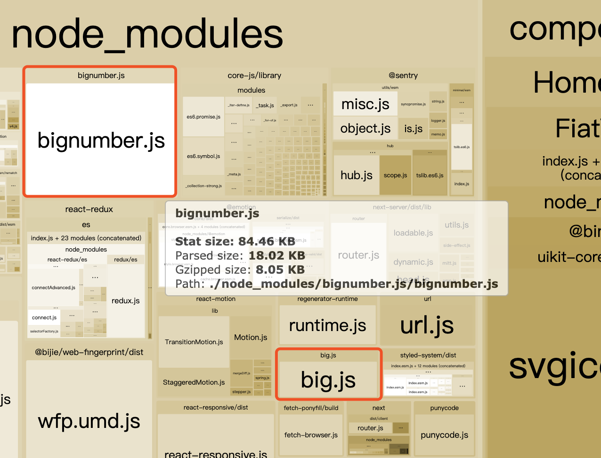  
use bignumber.js only or big.js only.

- use a lightweight library, or not use it
For example:
  - npm package `moment` is too large, maybe use `date-fns` instead.
  - lodash.merge is too large, maybe write a merge function by yourself.
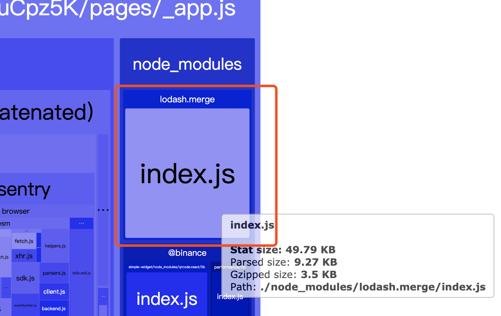  

- add Import Cost extension in vscode, to see import cost while coding.
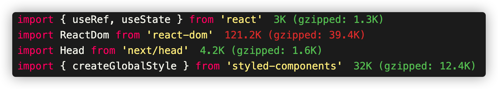  
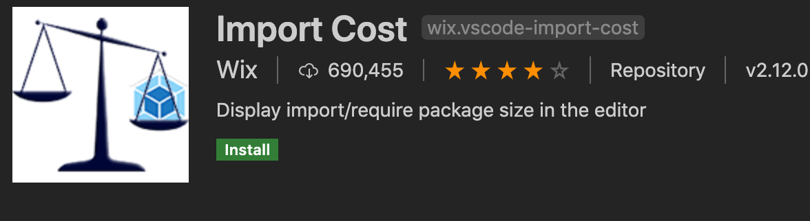  


### LCP element
Find the element which is associated with LCP, follow the picture below
if the element is ``, then minimize image size,  prefetch it with `<link rel=”preload”>`, render it in Server-Side if possible.
if the element is `<text>`, then render it in Server-Side if possible.
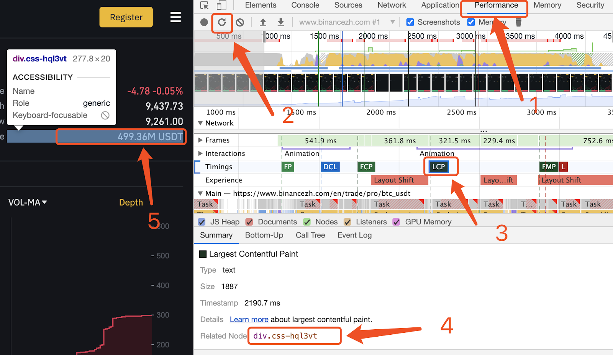  


### Preload main static resources 
For example
```html
<head>
  <link rel="preload" as="script" href="https://static-file-1259603563.file.myqcloud.com/static/chunks/bnc~pl~2.a4b870c7.js" crossorigin="anonymous"> 
  <link rel="preload" as="style" href="https://static-file-1259603563.file.myqcloud.com/static/fonts/index.min.css" crossorigin="anonymous"> 
  <link rel="preload" as="font" type="font/otf" cross-origin="anonymous" href="https://static-file-1259603563.file.myqcloud.com/static/fonts/bp/BinancePlex-SemiBold.otf">
  <link rel="preload" as="image" href="img.png"> 
</head>
```

### Preconnect domain
use both `preconnect` and `dns-prefetch` for browser compatibility  
For example
```html
<head>
  <link rel="preconnect" href="https://bin.bnbstatic.com"> 
  <link rel="dns-prefetch" href="https://bin.bnbstatic.com">
  <link rel="preconnect" href="https://static-file-1259603563.file.myqcloud.com"> 
  <link rel="dns-prefetch" href="https://static-file-1259603563.file.myqcloud.com">
</head>
```

### Reduce font size
`.otf` font is too large, use `.woff2`  instead, and it’s size needs to be < 20KB. Preload it. Ask UI Designer for  `.woff2` and small files.

### Reduce SSR time
Load components dynamically, if this component does not affect seo
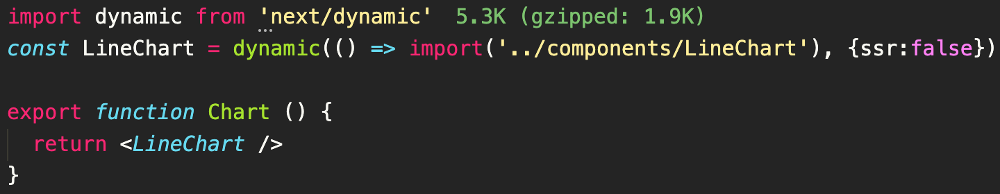  


## Reduce FID 

### JS runtime optimization
- Find components that take a long time to render, then optimize it.  
Run the page locally, open chrome dev tool
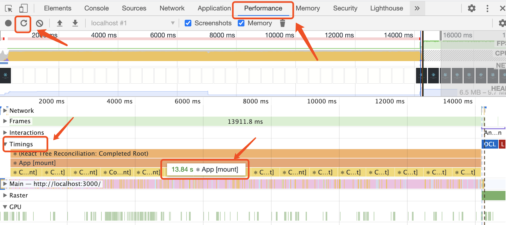  

Temporarily disable all Chrome extensions, especially React Dev Tools. They can significantly skew the results!

- Another way to see Component Render Timing  
Install React Dev Tool： https://chrome.google.com/webstore/detail/react-developer-tools/fmkadmapgofadopljbjfkapdkoienihi?hl=en  
Run the page locally, open dev tool, and optimize the component
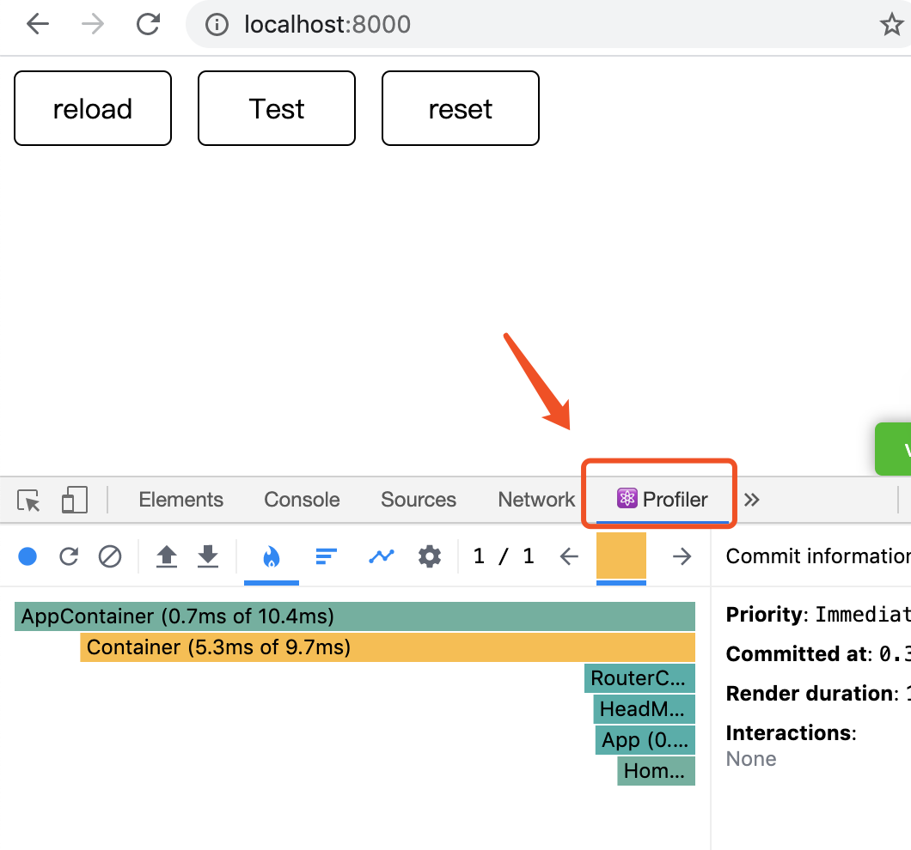  

- Several optimizations  
https://zh-hans.reactjs.org/docs/optimizing-performance.html#virtualize-long-lists
- Hooks optimization  
https://zh-hans.reactjs.org/docs/hooks-faq.html#performance-optimizations


## Reduce CLS
### Set Height for each element
set height for each element

## Other Optimization
### Reduce dom nodes
### Service worker
### Reduce unnecessary JS and CSS
### Reduce the number of requests
### CSS/ JS Coverage
### Use Brotli instead of Gzip


## Additional optimization in China 

### Remove www.google.com related js
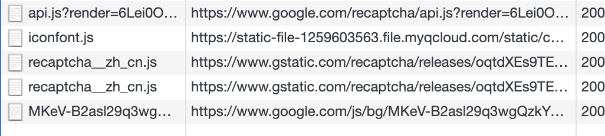  

### Public Api Accelerate
Doc: https://docs.google.com/document/d/15yuCuzm1zrBghan7meKW9GVZhtvBKi5pa9Ry9IUvkmY/edit?usp=sharing
