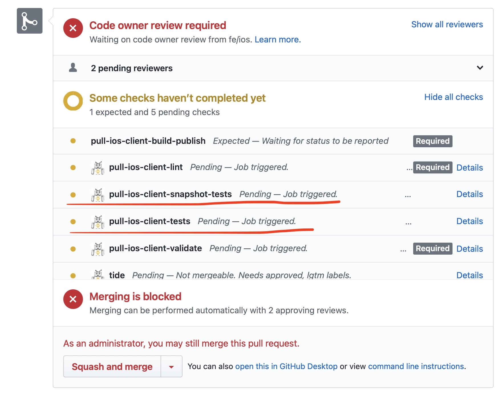
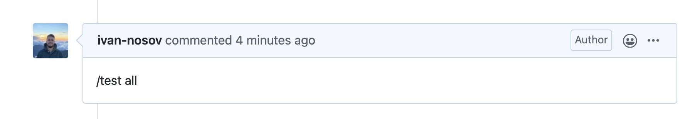
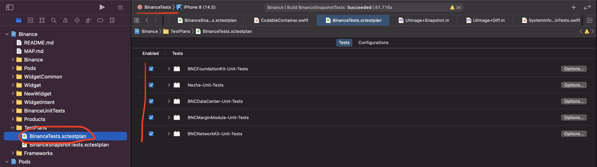
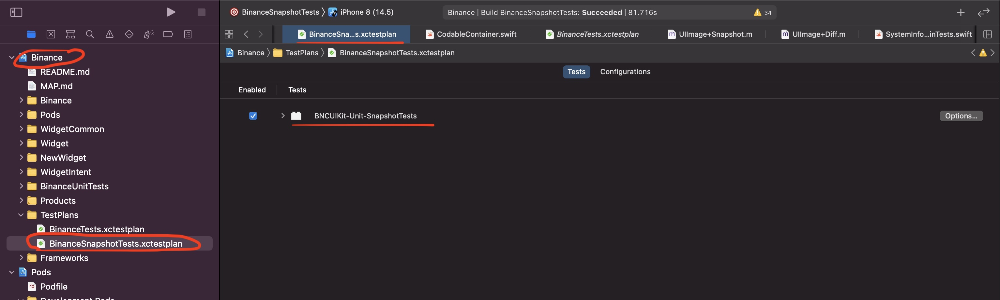
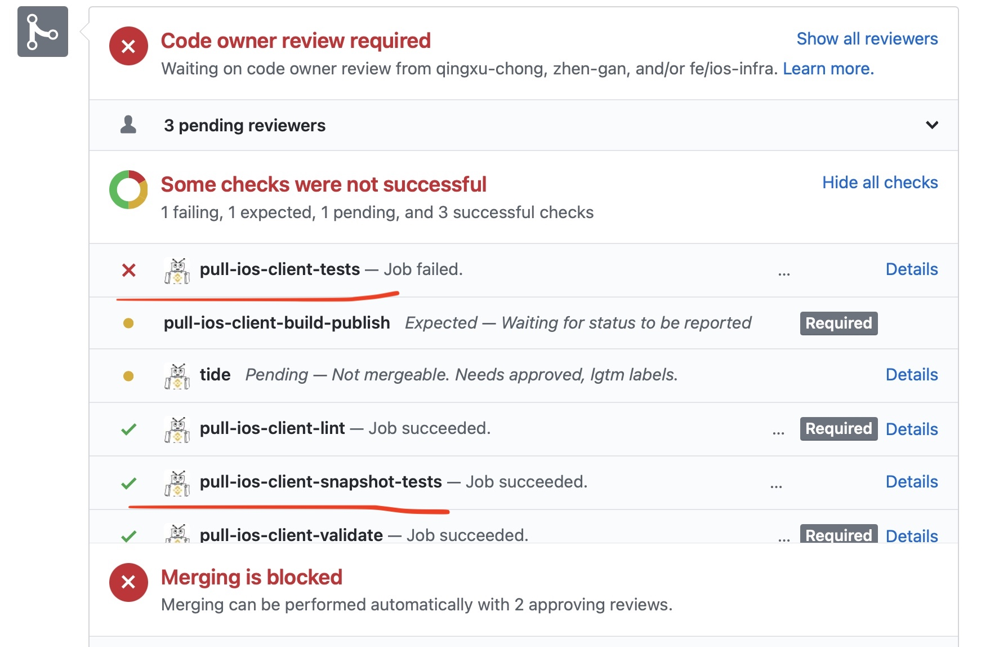
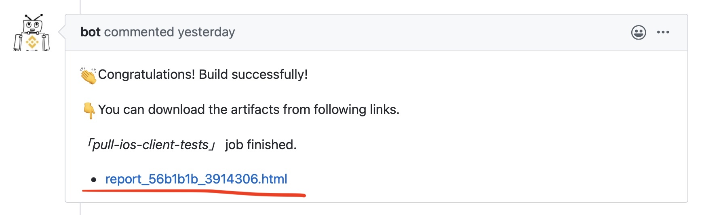
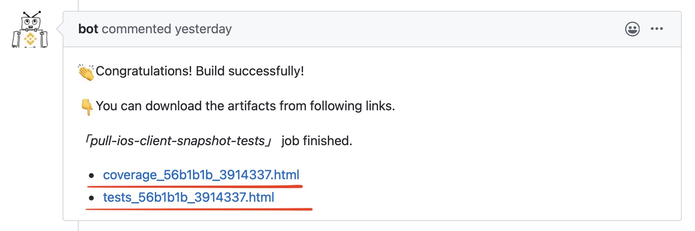
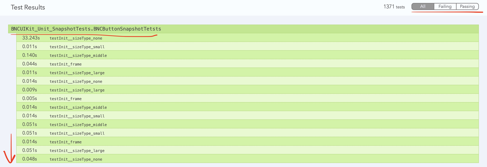
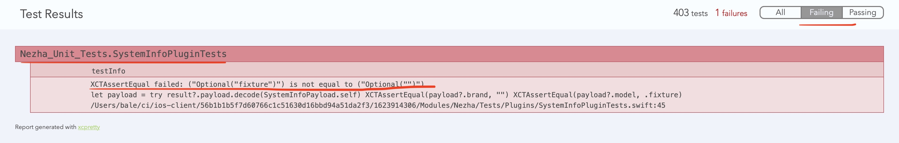
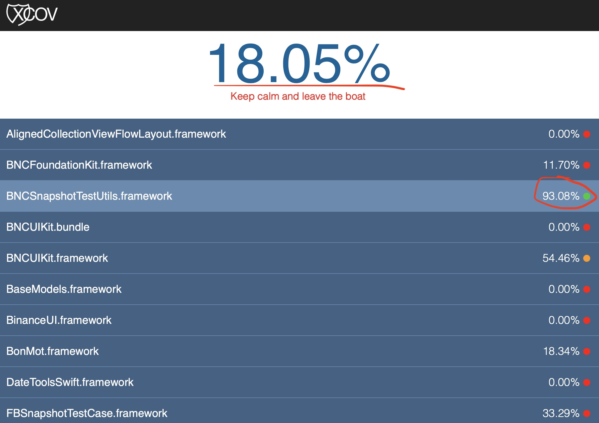

## Introduction

There are two jobs on CI, which executes unit tests and snapshot tests - `pull-ios-client-tests`, `pull-ios-client-snapshot-tests`. They executes two aggregate targets in Binance workspace - `BinanceTests` and `BinanceSnapshot Tests`. They are mandatory for merging the code to `bnbfly` and `master` branches.

## How do they look like

There are two separate jobs on CI, they report status to pull request checks as following - `pull-ios-client-tests`, `pull-ios-client-snapshot-tests`.

## How to run CI test run jobs

To run those new jobs you you can use PR comment `/test all`, this will run two jobs. Alternatively you can use `/test tests` and `/test snapshots` accordingly. Note that `/test all` also rerun lint and validation, so the recommendation not to re-run all jobs, if only one is failed, it is better to run a specific CI job.

## What exactly in test runs

The jobs run specific aggregate targets in Binance workspace, `/test tests` is for `BinanceTests` and `/test snapshots` is for `BinanceSnapshotTests`. Both targets use specific test plans with same names `BinanceTests.xctestplan` and `BinanceSnapshotTests.xctestplan`. Snapshots need to be tested in different configurations, this is why we have two different test plans.

## How to check results

Whenever tests are failed or succeed you can check the results in a pull request checks status.

There are few scenarios of the test execution:

- **Test is not compilable**, there is no test runs. In this case it just fails the check and there are no additional reports.

(No image)

- **Test is compilable, but test execution has been failed**. In this case you may find a comment in pull request which posts the html report. You can open the report and find failed tests in appropriate tab.

- **Test successfully passed**. In this case the job posts the test execution report and coverage report in a comment to PR. You may find how many tests are executed and total test coverage per module in two separate reports. Please note that both jobs post results independently, so you can see results for jobs in two separate pull request comments.

In test reports posted in a PR comment you can check:

- Which tests are exactly executed, which of them are failed, and what was the execution time.

- Total test coverage of the app modules / frameworks, it is available only if test passed without failures.

## How to add my tests for the CI job

Just simply put them to appropriate xctestplan in Binance workspace. Note that `BinanceSnapshotTests` is executed in specific configurations and it should only group exactly snapshot tests, all other kind of tests should be added to `BinanceTests`. All tests should be added to the main workspace through cocoapods testspec feature (please check existing unit tests).

## Known issues

Currently test runs does not include `BNCFuturesModule-Unit-Tests` and `BinanceUnitTests`. They depend on some libraries, for example `BNCFacePlusPlus`, which are not currently compilable for Apple Silicon / arm64 Simulators. Please bear this in mind when adding new tests. Current issues with `BNCFuturesModule-Unit-Tests` could be solved with dependency inversion and stubbing the dependencies which are not currently supported.
