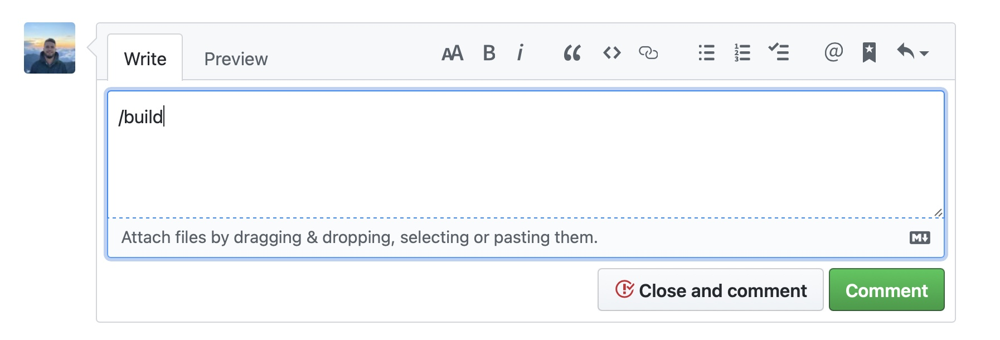
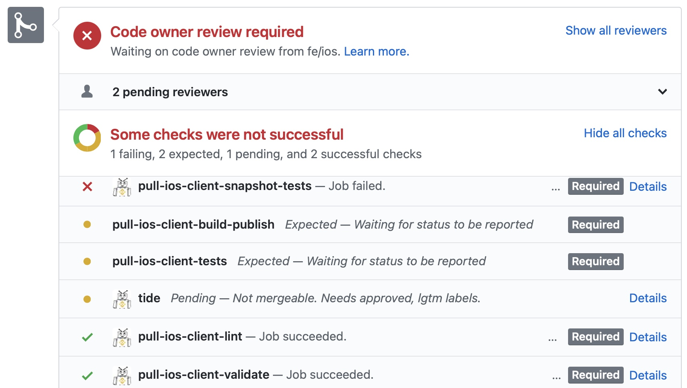

## Introduction

Binance uses [prow](https://github.com/kubernetes/test-infra/tree/master/prow) as CI/CD system. Prow executes jobs that can be triggered automatically on new commits or by using trigger comments in pull requests.

Each job represent specific github check in a pull request. There are some required checks, to merge a pull request they all should successfully pass.

## Available jobs / commands

### Required

#### `**pull-ios-client-build-publish**`

**Trigger:** `/build`

**Run:** Manual

**Description:**

This job builds Binance application, this is to make sure that pull request is buildable and the branch can compile.

#### `**pull-ios-client-lint**`

**Trigger:** `/lint lint`

**Run:** Automatic

**Description:**

This job runs SwiftLint with root config on changed files in pull request. It is only failed if pull request contains any serious violations. It is not failed in case of warning, but please address as much as reasonable. Later the strictness of this check will be increased.

#### `**pull-ios-client-validate**`

**Trigger:** `/tcheck`

**Run:** Automatic

**Description:**

The job validates localization for pull requests.

#### `**pull-ios-client-snapshot-tests**`

**Trigger:** `/test snapshots` / `/test all`

**Run:** Manual

**Description:**

This job executes all snapshot tests for Binance app and modules. It runs `BinanceSnapshotTests` scheme (`BinanceSnapshotTests` test plan). This Job can be triggered individually by `/test snapshots` or together with other tests by `/test all`.

#### `**pull-ios-client-tests**`

**Trigger:** `/test tests` / `/test all`

**Run:** Manual

**Description:**

This job executes all unit tests for Binance app and modules. It runs `BinanceTests` scheme (`BinanceTests` test plan). This Job can be triggered individually by `/test tests` or together with other tests by `/test all`.

### Optional

#### `**pull-ios-client-build-publish**`

**Trigger:** `/publish`

**Run:** Manual

**Description:**

This job builds Binance application in `Dev Release` config and uploads IPA to https://app.toolsfdg.net/ for local distribution and testing.

#### `**pull-ios-client-testflight-publish**`

**Trigger:** `/testflight`

**Run:** Manual

**Description:**

This job builds Binance app in `AppStore Release` configuration and uploads IPA to TestFlight.

#### `**pull-ios-client-publish-enterprise**`

**Trigger:** `/enterprise`

**Run:** Manual

**Description:**

This job builds obfuscated IPA in `Enterprise Release` configuration.

#### `**pull-ios-client-simulator-publish**`

**Trigger:** `/simulator`

**Run:** Manual

**Description:**

This job builds Binance application in `Dev Debug` configuration and uploads zip archive for installation on simulator.

#### `**pull-ios-client-simulator-publish-dev-release**`

**Trigger:** `/simulator dev-release`

**Run:** Manual

**Description:**

This job builds Binance application in `Dev Release` configuration and uploads zip archive for installation on simulator.

#### `**pull-ios-client-lint-format**`

**Trigger:** `/lint format`

**Run:** Manual

**Description:**

Lint job, performs `swiftformat` and `swiftlint autocorrect` on changed files in current pull requests. Commits results to the existing pull requests. This job should be used as first choice to `/lint correct`, since `swiftformat` is more powerful tool. Later this job will be unified with autocorrect job.

#### `**pull-ios-client-integration-tests**`

**Trigger:** `/test integration`

**Run:** Manual

**Description:**

This job executes all integration tests for Binance app and modules. It runs `BinanceIntegrationTests` scheme (`BinanceIntegrationTests` test plan).

#### `**pull-ios-client-publish-enterprise-qa**`

**Trigger:** `/enterprise qa`

**Run:** Manual

**Description:**

This job builds obfuscated IPA in `Enterprise Debug` configuration.

#### `**pull-ios-client-build-publish-debug**`

**Trigger:** `/publish debug`

**Run:** Manual

**Description:**

This job builds Binance application in `Dev Debug` config and uploads IPA to https://app.toolsfdg.net/ for local distribution and testing.

#### `**pull-ios-client-publish-machine-27**`

**Trigger:** `/publish-27`

**Run:** Manual

**Description:**

This job builds Binance application on specific CI host (`192.168.250.27`) and uploads IPA to https://app.toolsfdg.net/ for local distribution and testing.

#### `**pull-ios-client-publish-machine-m1**`

**Trigger:** `/publish-m1`

**Run:** Manual

**Description:**

This job builds Binance application on specific CI host with `Apple Silicon M1` processor and uploads IPA to https://app.toolsfdg.net/ for local distribution and testing.

#### `**pull-ios-client-publish-test-merge-release**`

**Trigger:** `/sync-release`

**Run:** Manual

**Description:**

This job is used for synchronization of bnbfly with latest hotfix changes in release branch. It automatically creates pull request with sync changes.

#### `**pull-ios-client-pod-example-validate**`

**Trigger:** `/check-example`

**Run:** Manual

**Description:**

This job builds all available examples to check if they are compilable.

#### `**pull-ios-client-testflight-clean**`

**Trigger:** `/testflight clean`

**Run:** Manual

**Description:**

This job removes inactive users in TestFlight.

#### `**pull-BNCUIKit-Demo-publish**`

**Trigger:** `/publish BNCUIKit`

**Run:** Manual

**Description:**

This job builds BNCUIKit demo application and uploads IPA to https://app.toolsfdg.net/ for local distribution and testing.

#### `**pull-ios-client-envprint**`

**Trigger:** `/envprint`

**Run:** Manual

**Description:**

Debug job, posts all env variables available for current job context.
