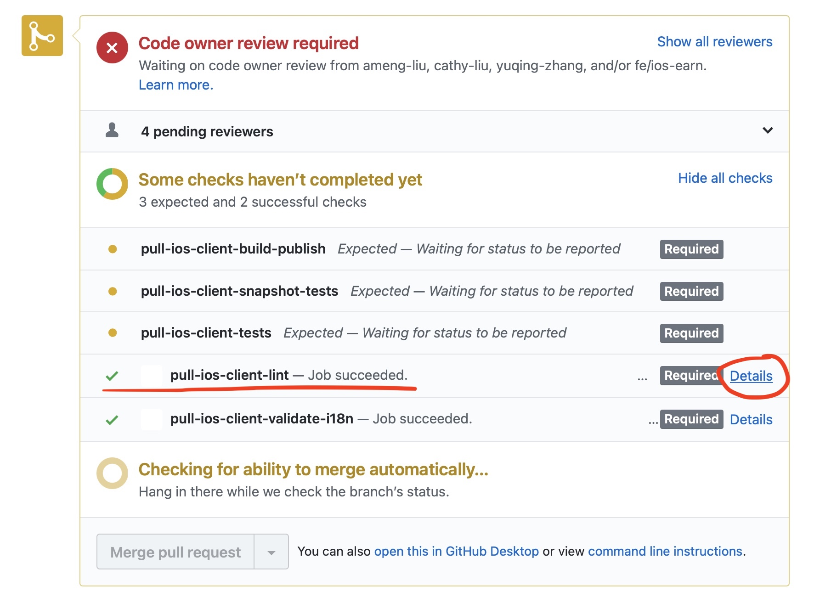
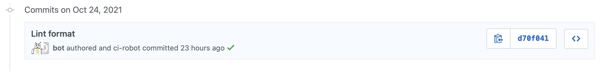
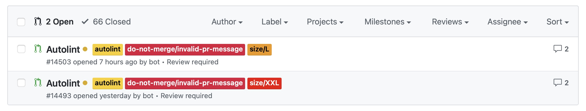
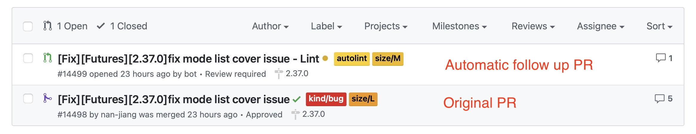

## Overview

Code quality is very important aspect of software development. In Binance we use CI for watch and improve code quality on some levels, which is achieved by various lint jobs available on CI server.

It is important to understand that lint tools does not fully address all possible issues with code, but helps to minimize manual work and eliminate some common mistakes that can be detected automatically and does not require human participation. This is what's called Automated Code Review. Developers can concentrate on other aspects of code reviews which can't be addressed automatically.

Here's what is the main goals of using automatic code reviews:
- Detect direct issues in the code, including performance issues, fall tolerance issues, whatever affects the app
- Highlight readability and maintenance issues, that does not directly affect the product
- Provide consistent formatting and automatically apply the unified code style

We prefer to use CI to do this job instead of having those tools locally, because it allows to address issues in asynchronous way (you can focus on the product) and also resolve possible issues with local environment inconsistency.

Currently we use following tools on CI:
- SwiftLint - basic issues detection and autocorrect feature
- SwiftFormat - formatting feature
- To be continued

## Basic lint check job - `/lint lint`

`pull-ios-client-lint` - basic job for detecting lint issues. It automatically executes on each commit in each pull requests in `ios-client` repo, doesn't matter which branch is that. Can be re-triggered by `/lint lint` command.

SwiftLint uses one single config `.swiftlint.yml` in repo root directory. Module owners can use own internal configuration, because it is read recursively (this is not recommended though).

Job output is available in `Details` in `pull-ios-client-lint` job status on github.

Lint output includes both errors and warnings in the output. You should fix all errors to be able to proceed with merge. You should fix as much warnings as possible at the moment (it will affect the final code quality metrics). In the future as the count of warnings will decrease we will move some warnings to errors category to make rules more strict.

## Manual lint format job - `/lint format`

`pull-ios-client-lint-format` - CI job for automatic formatting in the existing pull request. It is triggered on demand manually by using `/lint format`.

CI performs some code formatting work, and then commits the results back to the pull request. It takes only files that are modified in the pull request. Do not forget to pull the changes after successful running of this job.

The results of this job should be carefully checked, because sometimes it may affect compilation results or propose inconsistent ("weird") formatting, especially for long lines.

This job includes both SwiftFormat and SwiftLint autocorrect to perform the code modification. If you need to disable some of the autoformatting, you should include both `// swiftlint:disable ...` and `// swiftformat:disable` to the affected area (See documentation for tools for more info).

## Autolint periodic job

`pull-ios-client-autolint-periodic` - special job, that is performed periodically (few times a day).

It takes 10 next files and apply `/lint format` to those files, commit changes and creates new pull request. Pull requests are marked by `autolint` label, you can use this to find all opened pull request for checking and merge.

Since sometimes formatting may unexpectedly affect the pull request, every autolint pull request should be carefully checked and all CI should be also ran for this work to make sure nothing is affected.

As part of this pull request verification, you should also check existing lint warnings or errors which can't be addressed automatically. You should address them in current pull request.

## Autolint post submit job

`post-ios-client-lint-format` - post submit CI job, that applies lint changes to recently merged pull request. This allows to make sure that code which is merged to bnbfly follows code style and doesn't contain lint issues.

It creates pull request with same name with "... - Lint" at the end of the original pr name, branch name follows similar rule, it adds "..._lint" at the end of the original branch name. Pull request s also marked by `autolint` label.

Similar to periodic job, as part of this pull request verification, you should also check existing lint warnings or errors which can't be addressed automatically. You should address them in current pull request.

Sometimes pull request of this type could be relatively huge (1000+ lines), in this case it is recommended to close pull request and wait for periodic job to find issues and apply changes in smaller batches.

## Usage strategies

It is recommended to run `/lint format` in each pull request. However if your pull request adds a lot of changes to multiple existing un-linted files, then it is recommended to merge without `/lint format` and wait for post submit job to address lint issues in the separate pull request. This should make review process easier, since you split it into two independent parts. But if your pull request adds many new files without touching other parts, then it would be more preferable to `/lint format` on the original pull request.

Each automatically created pull request or commit should be fully verified with all CI checks. You should also address warnings of common lint check, please address according to existing resources, some of the warnings can be addressed later, especially those ones that requires to make significant architectural changes.

