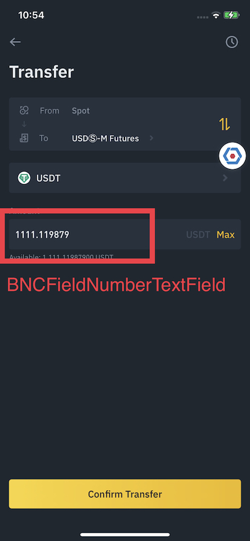

# BNCFieldNumberTextField
Used when amount number should be formatted (rounded) before being filled in the text field.
- Supporting dynamic fraction digits and rounding.
- Default grouping mode is `half even`.
- Grouping separator is `disabled`.
- Supporting Themable
- Supporting interface builder

```
Condition:
Decimal number: 123456.7890234
Minimum fraction digits: 2
Maximum fraction digits: 4
Rounding: halfEven

Expected result (en):
123456.789
```

```swift
// Sample Code
let textField = BNCFieldNumberTextField()
let config = BNCFieldNumberTextField.Config(
    minimumFractionDigits: 2,
    maximumFractionDigits: 4
)
textField.setValue(123456.7890234, config: config)
```



## Config
- **minimumFractionDigits:** Int
  - Default: **0**
- **maximumFractionDigits:** String
- **rounding:** NumberFormatter.RoundingMode
  - Default: .halfEven

## Methods
- **setValue<Value: BNCNumberFormattable>(_ value: Value, config: Config):** Format value with defined config, value conforms to BNCNumberFormattable

## Properties

- @IBInspectable public var textColorThemeKey: String?
- @IBInspectable public var disabledTextColorThemeKey: String?
- @IBInspectable public var backgroundColorThemeKey: String?
- @IBInspectable public var placeholderColorThemeKey: String?
- @IBInspectable public var borderColorThemeKey: String?
- @IBInspectable public var clearButtonImageNameBase: String?
- @IBInspectable public var clearButtonColorThemeKey: String?
- @IBInspectable public var canPaste: Bool = true
