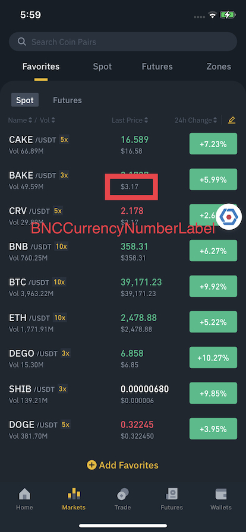

# BNCCurrencyNumberLabel

Display price with currency symbol, rounding mode is fixed to `down`.
- Grouping separator is `enabled`.

```
Condition:
Decimal number: 12345.67895
Fraction digits: 2
Currency Symbol: $$

Expected result (en region):
$$12,345.67
```

```swift
// Sample Code
let label = BNCCurrencyNumberLabel()
let config = BNCCurrencyNumberLabel.Config(
    digits: 2,
    currencySymbol: "$$"
)
label.setValue(12345.67895, config: config)
```



## Config
- **digits:** Int
  - Default: **2**
- **currencySymbol:** String
  - Default: **$**

## Methods
- **setValue<Value: BNCNumberFormattable>(_ value: Value, config: Config):** Format value with defined config, value conforms to BNCNumberFormattable

## Properties

- @IBInspectable public var textColorThemeKey: String?
- @IBInspectable public var backgroundColorThemeKey: String?
