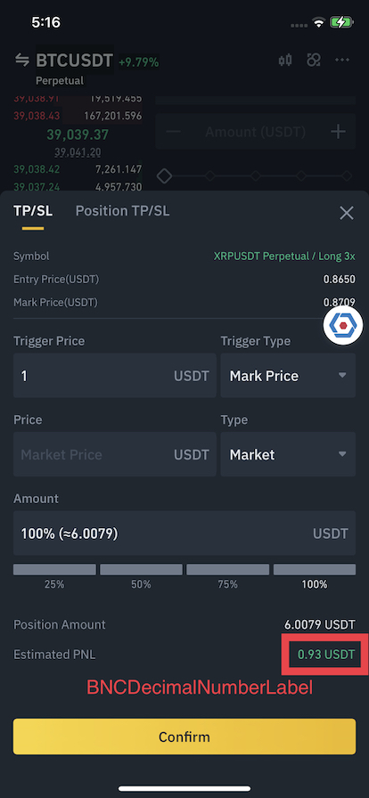

# BNCDecimalNumberLabel

Display formatted decimal numbers, supporting dynamic fraction digits, grouping separator, rounding, and a trailing unit symbol.
- Default grouping mode is `down`.

```
Condition:
Decimal number: 12345.67895
Minimum fraction digits: 2
Maximum fraction digits: 4
Rounding mode to the maximum fraction digits: Down
Show grouping separator: YES
Trailing unit: USDT

Expected result (en region):
12,345.6789 USDT
```

```swift
// Sample Code
let label = BNCDecimalNumberLabel()
let config = BNCDecimalNumberLabel.Config(
    minimumFractionDigits: 2,
    maximumFractionDigits: 4,
    rounding: .down,
    usesGroupingSeparator: true,
    unit: "USDT"
)
label.setValue(12345.67895, config: config)
```



## Config
- **minimumFractionDigits:** Int
  - Default: **0**
- **maximumFractionDigits:** Int
- **rounding:** NumberFormatter.RoundingMode
  - Default: **.down** 
- **usesGroupingSeparator:** Bool
  - Default: **true**
- **unit:** String?
  - Default: **nil**

## Methods
- **setValue<Value: BNCNumberFormattable>(_ value: Value, config: Config):** Format value with defined config, value conforms to BNCNumberFormattable

## Properties

- @IBInspectable public var textColorThemeKey: String?
- @IBInspectable public var backgroundColorThemeKey: String?
