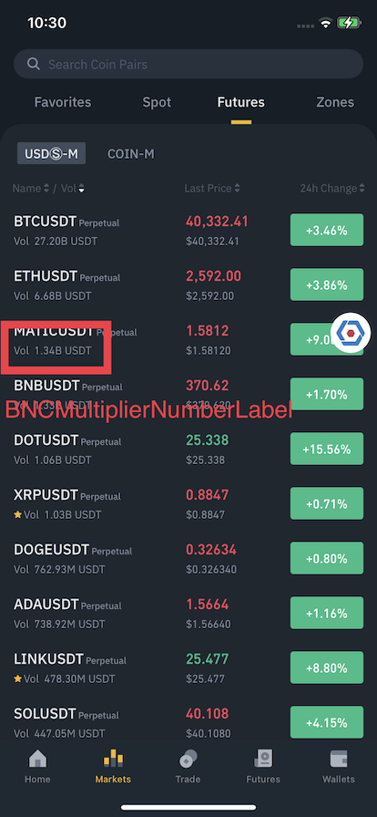

# BNCMultiplierNumberLabel

Display volume number, supporting metric prefix with unit.
- Prefix of text is supported.
- Rounding mode is `half up`.
- Grouping separator is `enabled`.
- Metric prefix is localized for some languages.

```
Condition:
Decimal number: 1234567890123
Fraction digits: 2
Unit: USD
Prefix: "Volume "

Expected result (App language: English):
Volume 1.23T
```

```swift
// Sample Code
BNCNumberFormatter.shared.setLanguage(
    // Assume "en"
    LocalizationConverter.currentLanguage.toFrontendLanguageCode
)
let label = BNCMultiplierNumberLabel()
let config = BNCMultiplierNumberLabel.Config(
    digits: 2,
    unit: "USD",
    prefix: "Volume "
)
label.setValue(1234567890123, config: config)
```



## Config
- **digits:** Int
  - Default: **2**
- **unit:** String
  - Default: ""
- **prefix:** String
  - Default: ""

## Methods
- **setValue<Value: BNCNumberFormattable>(_ value: Value, config: Config):** Format value with defined config, value conforms to BNCNumberFormattable

## Properties

- @IBInspectable public var textColorThemeKey: String?
- @IBInspectable public var backgroundColorThemeKey: String?
