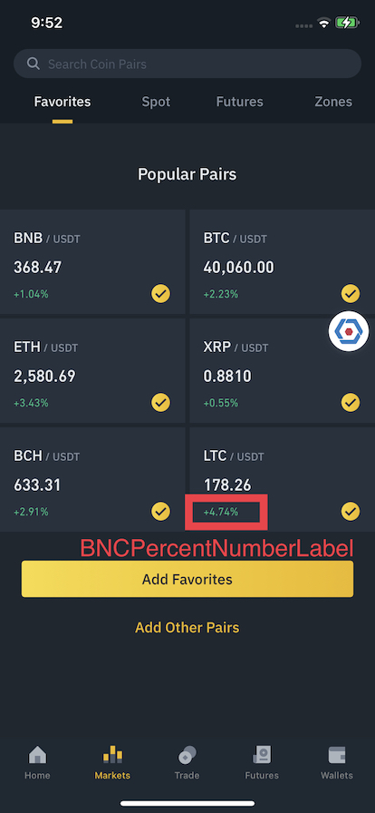

# BNCPercentNumberLabel

Display `floating number` to percentage style.
- Fraction digits, sign, and rounding mode can be configured.
- Default grouping mode is `half even`.

```
Condition:
Decimal number: 0.12345
Fraction digits: 2
Sign: forced
Rounding mode: down

Expected result (en region):
+12.34%
```

```swift
// Sample Code
let label = BNCPercentNumberLabel()
let config = BNCPercentNumberLabel.Config(
    digits: 2,
    sign: true,
    rounding: .down
)
label.setValue(0.12345, config: config)
```



## Config
- **digits:** Int
  - Default: **2**
- **sign:** Bool
  - Default: **2**
- **rounding:** NumberFormatter.RoundingMode
  - Default: **.halfEven** 

## Methods
- **setValue<Value: BNCNumberFormattable>(_ value: Value, config: Config):** Format value with defined config, value conforms to BNCNumberFormattable

## Properties

- @IBInspectable public var textColorThemeKey: String?
- @IBInspectable public var backgroundColorThemeKey: String?
