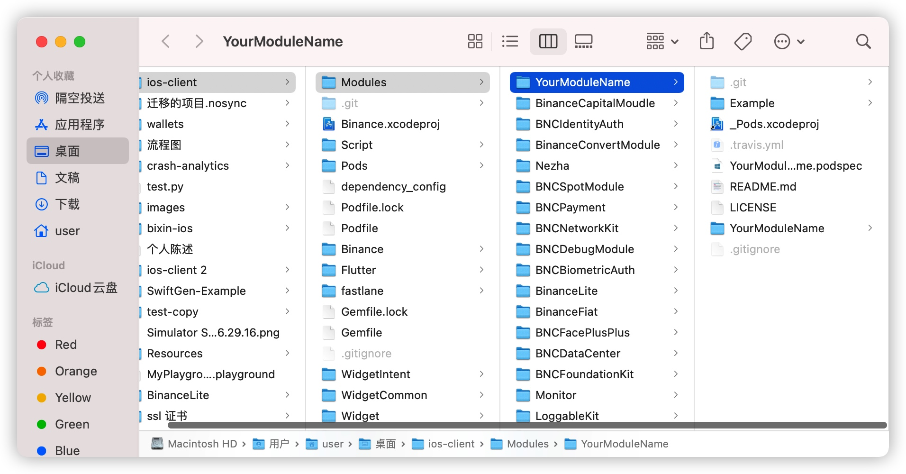
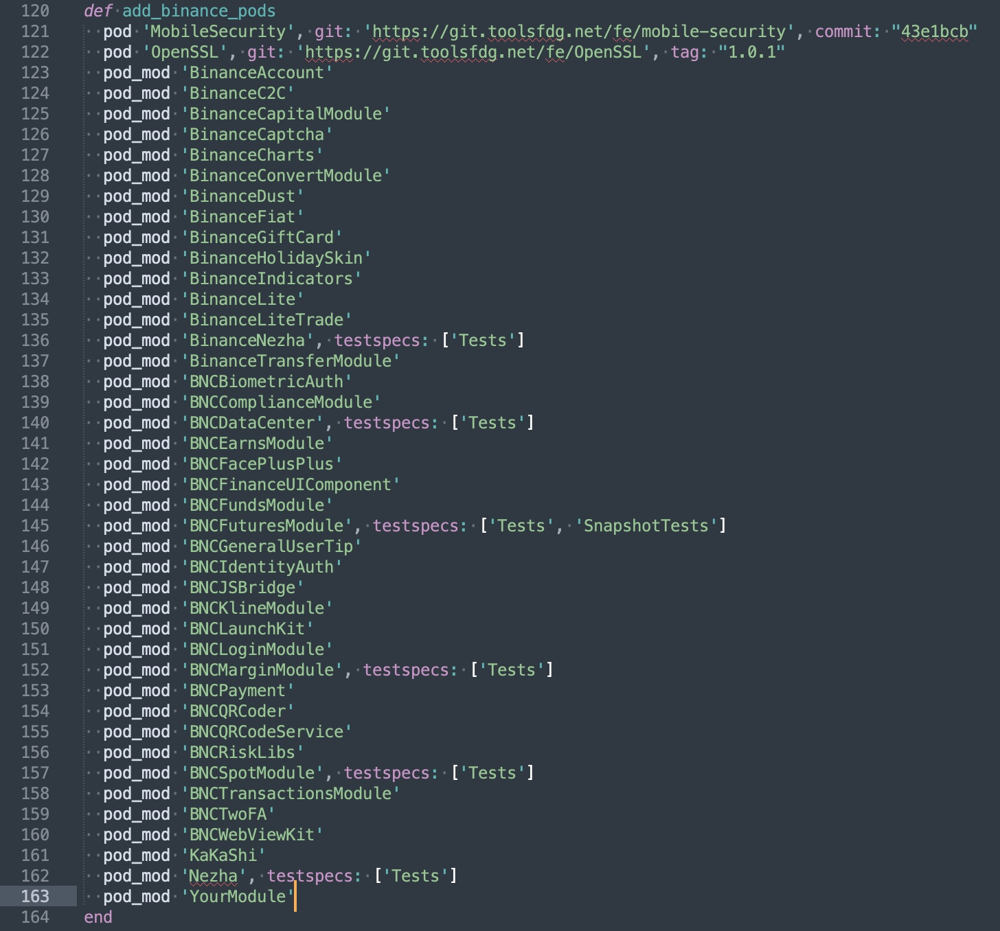
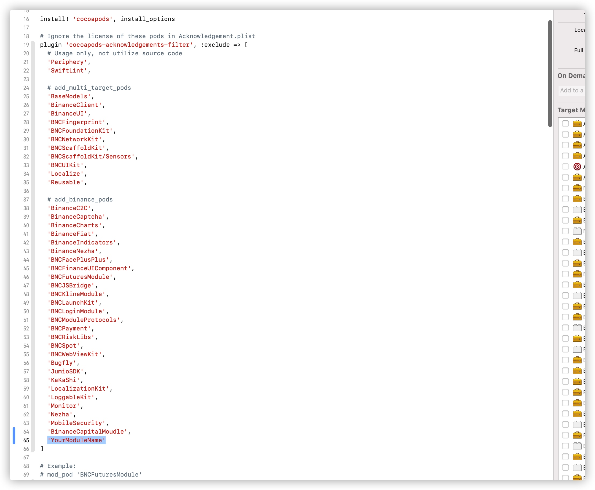

# 创建module 工程
```
cd ios-client/Modules
pod lib create YourModuleName --template-url=https://git.toolsfdg.net/fe/binance-pod-template.git
```
会出来以下几个选项
```
To get you started we need to ask a few questions, this should only take a minute.

If this is your first time we recommend running through with the guide:
 - https://guides.cocoapods.org/making/using-pod-lib-create.html
 ( hold cmd and click links to open in a browser. )


What platform do you want to use?? [ iOS / macOS ]
 > iOS

What language do you want to use?? [ Swift / ObjC ]
 > Swift

Would you like to include a demo application with your library? [ Yes / No ]
 > Yes

Which testing frameworks will you use? [ Quick / None ]
 > None

Would you like to do view based testing? [ Yes / No ]
 > No
```
然后你就得到了一个module 的example 工程，我们可以先忽略这个工程
# 引入module 到主工程
## 删除git文件夹
在finder 中打开你的module,并且cmd+shift+.开启隐藏文件夹,找到`.git`和`.gitignore`文件并删除

## 在podfile 中导入库
找到podfile文件中的add_binance_pods方法，并添加你库，例如`pod_mod 'YourModuleName'`，按字母的顺序排好

## 添加license 忽略
找到`plugin 'cocoapods-acknowledgements-filter'`, 并添加你的库, 例如`'YourModuleName'`，按字母的顺序排好

设置完成之后，在ios-client 文件夹下执行
```
bundle exec pod install --repo-update
```
install 完成之后就可以在项目的Pods/Development Pods/文件夹下看看到你的库了
**注意:**
> 此处需要在ios-client目录下执行

## 设置.podspec
打开ios-client/modules/YourModuleName/YourModuleName.podspec 进行简单的配置
深入配置可参考冬瓜大佬的[Podspec 文件分析](https://www.desgard.com/2020/10/12/cocoapods-story-5.html)
```
Pod::Spec.new do |s|
  s.name             = 'YourModuleName'
  s.version          = '0.1.0'
  s.summary          = 'A short description of YourModuleName.'

# This description is used to generate tags and improve search results.
#   * Think: What does it do? Why did you write it? What is the focus?
#   * Try to keep it short, snappy and to the point.
#   * Write the description between the DESC delimiters below.
#   * Finally, don't worry about the indent, CocoaPods strips it!

  s.description      = <<-DESC
TODO: Add long description of the pod here.
                       DESC

  s.homepage         = 'https://git.toolsfdg.net/fe/YourModuleName'
  # s.screenshots     = 'www.example.com/screenshots_1', 'www.example.com/screenshots_2'
  s.license          = "All rights reserved."
  s.author           = { "Binance" => "app@binance.com" }
  s.source           = { :git => 'https://git.toolsfdg.net/fe/YourModuleName.git', :tag => s.version.to_s }
  # s.social_media_url = 'https://twitter.com/<TWITTER_USERNAME>'

  s.swift_version    = '5.1'
  s.ios.deployment_target   = '12.0'

  s.source_files = 'YourModuleName/Classes/**/*'
  
  s.resource_bundles = {
    'YourModuleName' => ['YourModuleName/Assets/**/*', 'YourModuleName/Classes/**/*.{xib,nib,storyboard}']
  }

  # s.dependency 'AFNetworking', '~> 2.3' 依赖库
end

```
配置完成之后我们就可以开始添加代码了额
## 添加代码
代码文件是放在YourModuleName/YourModuleName/Classes文件夹中的，如自动生成的ReplaceMe.swift文件，这里我们可以把此文件删除，添加自己的代码文件
## 添加资源文件
图片资源文件可以放在YourModuleName/YourModuleName/Assets中, 可以在项目中创建Assets.xcassets 管理图片资源
