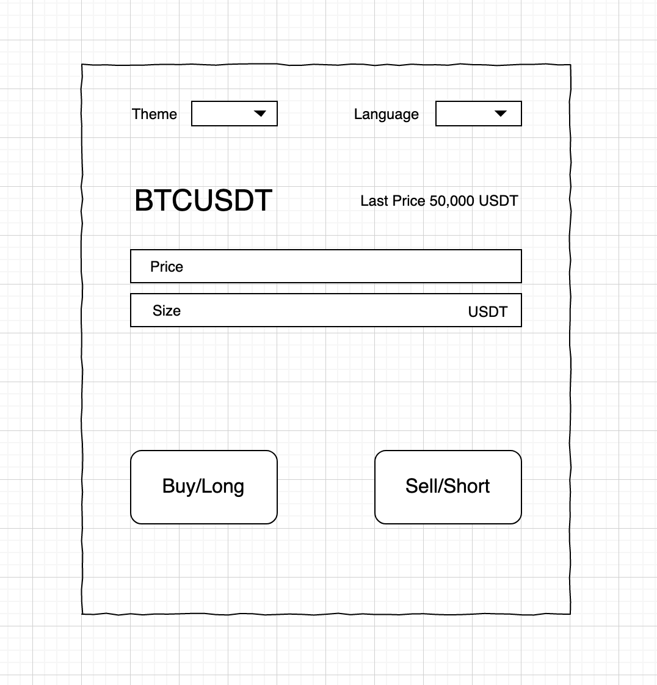

> That's one small step for you, one giant leap for futures.

Through these trials, you can learn about futures-trade-ui code, mono development model, git flow, CICD, i18n, UIKit.

## Futures Form

### Content

This page shows the latest price of BTCUSDT, and users can enter the price and quantity, click the button to open a limit order for BTCUSDT.

### How to

Fork [mono](https://git.toolsfdg.net/mono/mono).

In the `web/apps/futures-trade-ui` directory, create a new page.

route: `/:lng/futures/newbie`

#### Related Code

last price: `web/apps/futures-trade-ui/src/hooks/useSubscribeLastTradePriceOnCondition.ts`

place order: `web/apps/futures-trade-ui/src/model/futuresOrderForm/model.ts → placeOrder`

#### Notes

- Dark and light theme
- UIKit components
- i18n (English/Chinese)
- TypeScript

Commit the code, create a PR, and release it to the QA environment for acceptance by chenxuan.ling@binance.com.

## Improvement
Improve anything in futures-trade-ui.

## Summary
Write down your feeling since you joined and what the team can improve you hope.
